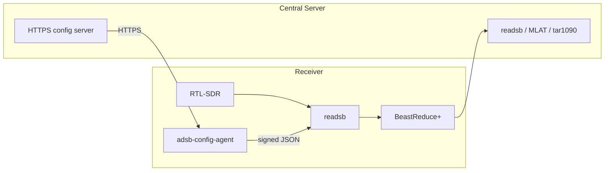

# Reproducible ADS-B receiver appliance image

This repository builds a reproducible, minimal, Armbian-based ADS-B edge
receiver appliance for RTL-SDR reception. It starts with the Orange Pi Zero 3
and the official Armbian build framework, not a prebuilt feeder image. The receiver decodes
locally with Wiedehopf's `readsb` and forwards Beast data to the central ADS-B
server. It contains no UI, database, dashboard, Docker daemon, history, or
general-purpose feeder stack. That stuff belongs at the center where it can be
maintained once instead of multiplied by every antenna.

## Hardware targets and minimums

`config/targets.json` is the source of truth. Every `enabled: true` target is
built by `./build.sh`; passing target names limits the build. Artifacts are
written separately under `dist/<target>/`, so a mixed configuration produces an
image per board without cross-contaminating names or manifests.

| Target | Build board | Absolute minimum | Practical recommendation |
| --- | --- | --- | --- |
| Orange Pi Zero2 | `orangepizero2` | Estimated: 1 GiB RAM, 8 GiB SD card, Ethernet, one USB host port | Estimated: 2 GiB RAM, 16 GiB high-endurance SD card, RTL-SDR Blog V3 or equivalent |
| Orange Pi Zero3 | `orangepizero3` | Estimated: 1 GiB RAM, 8 GiB SD card, Ethernet, one USB host port | Estimated: 2 GiB RAM, 16 GiB high-endurance SD card, RTL-SDR Blog V3 or equivalent |

For a future device, add a target with its Armbian `BOARD` name, architecture,
and `minimumHardware`. As a planning floor, do not add a receiver below 1 GiB
RAM, 8 GiB storage, one reliable USB host port, and wired Ethernet. The image
does not need much CPU, but weak power supplies and bargain SD cards create the
kind of mystery failures that waste a Saturday.

## Architecture



At boot, `adsb-config-agent.service` waits for network, downloads JSON plus its
minisign signature, verifies it with the image's public key, validates the
strict schema, renders a deterministic readsb argument file, and atomically
installs it. `readsb` starts only when that argument file exists. A failed or
unavailable fetch leaves the last known good configuration running. The refresh
timer defaults to 15 minutes; the schema accepts 60 seconds through 24 hours.

Identity preference is an explicitly provisioned `/etc/adsb-receiver/receiver-id`,
then the first non-loopback Ethernet MAC, then a persistent generated UUID.
The URL template in `config/build.json` substitutes `{receiver_id}`. A shared
endpoint is also possible by using a URL without that placeholder.

## Build

Build on a Linux host with Docker, privilege to run the Armbian framework, at
least 8 GiB RAM, and 50 GiB free disk. macOS is fine for editing and flashing,
but use a Linux runner or VM for the actual image build.

```bash
./build.sh                         # every enabled hardware target
./build.sh orangepi-zero3          # only this target
```

Fish users can run those commands unchanged. `build.sh` declares Bash itself,
so do not source it into Fish. A native macOS build is unsupported: use a
Linux VM or dedicated Linux host when the GitHub Actions build is unavailable.

For local fallback builds, `build.sh` pins the Armbian framework, Debian `trixie`,
and readsb commit in `config/build.json`. The authoritative build path is GitHub
Actions, which pins the official `armbian/build` action and framework to
`8de11a017f7f05a82c77850f8322928cb6a3b70c`. That exact upstream commit's
`VERSION` file is `26.05.0-trunk`; the commit is the authoritative identifier.
The action copies this repository's `userpatches/` into Armbian using its
standard mechanism.
Each successful build publishes a compressed `.img.xz` and checksum in a GitHub
Release, plus a workflow artifact containing the target snapshot, build manifest,
and all available Armbian `output/info/` source metadata. A normal image build
does not guarantee `git_sources.json`: the pinned framework writes it during
`artifact-config-dump-json` branch resolution. Its absence is recorded in the
build manifest instead of failing an otherwise valid image build.

The appliance release version (for example `2026.08.20.1`) is separate from
Armbian's internal image revision. The manual workflow uses the appliance
version for `/etc/adsb-receiver-release`, the GitHub Release tag/title, artifact
name, and build manifest. It deliberately leaves `armbian_version` unset so the
official Action resolves and increments its own supported three-part revision.

`config/targets.json` is also the single source of truth for each target kernel
commit. The workflow exports that target's `kernelRevision` as
`ADSB_KERNEL_REVISION` and enables `userpatches/extensions/adsb-kernel-pin.sh`.
Armbian runs its supported `late_family_config` hook before resolving sources;
the extension sets `KERNELBRANCH=commit:<kernelRevision>`. The official Action
still receives `armbian_kernel_branch: current` for the board's high-level kernel
classification, but kernel checkout is pinned to the declarative target commit.

Before a production build, replace the example public key at
`userpatches/overlay/etc/adsb-receiver/publickey.minisign`, set the URL template,
and copy `config/authorized_keys.example` to the ignored
`config/authorized_keys`, replacing its contents with administrator public keys.
The build refuses to continue without that nonempty file. The image creates the
`admin` user with passwordless sudo, disables password and root SSH login, and
installs only those supplied keys.

## Configuration and signing

The machine-readable contract is [schemas/receiver-config.schema.json](schemas/receiver-config.schema.json).
An example lives in [examples/config-server/config/default.json](examples/config-server/config/default.json).
Only a narrow allowlist of readsb extra options is accepted, and output hosts,
ports, protocols, coordinates, and intervals are validated. `beast_reduce_plus_out`
is the default because it is the intended reduced Beast forwarding path; choose
`beast_out` explicitly only when central MLAT testing proves it is required.

Generate a signing key on an administrator workstation, install only its public
key in the image, then sign each JSON file before deployment:

```bash
minisign -G -p receiver-config.pub -s receiver-config.key
examples/config-server/scripts/sign-config.sh receiver-config.key config/receiver-a.json
```

Keep `receiver-config.key` off the image, repository, Caddy container, CI logs,
and build artifacts. The Caddy example merely serves already signed static files.

## GitHub Actions, flashing, and recovery

`.github/workflows/validate.yml` runs on every push and pull request. It performs
fast shell, JSON, JSON Schema, target-contract, unit-file, private-key/token,
pin, documentation, and configuration-agent checks without building an image.

`.github/workflows/build-image.yml` is manual. It runs on a GitHub-hosted Ubuntu
24.04 runner and invokes the official Armbian GitHub Action directly, with
runner cleanup enabled for the required disk space. It does not recreate the old
Gitea runner-inside-container-inside-Docker arrangement. Before dispatching the
workflow, add the repository secret `ADSB_ADMIN_AUTHORIZED_KEYS` containing only
the public SSH keys authorized for the image. The value is consumed in the image
customization and never committed or printed. GitHub Releases contain the
flashable image and checksum; the Actions artifact also has the reproducibility
metadata.

To build, open **Actions**, choose **Build image**, click **Run workflow**, and
provide a unique image version such as `2026.08.20.1`. The initial matrix has one
enabled target. Adding another Armbian-supported target means adding its
declarative entry in `config/targets.json` and one matching matrix entry, not
redesigning the appliance.

To flash, download a known GitHub Release image and its SHA-256 file, verify the
checksum, decompress the image, then write it with Raspberry Pi Imager or Balena
Etcher. Connect Ethernet and the SDR, then boot. The receiver retrieves its
signed configuration and resumes from the server. If the configuration server is
temporarily unavailable, the last-known-good local configuration stays active.
For diagnostics:

```bash
systemctl status adsb-config-agent.service readsb.service adsb-config-refresh.timer
journalctl -u adsb-config-agent -u readsb
adsb-config-agent status
lsusb
```

Flashing with `dd` overwrites the selected disk. Prefer Raspberry Pi Imager or
Balena Etcher. On macOS, identify the removable disk with `diskutil list`, unmount
the exact disk, then use `sudo dd if=image.img of=/dev/rdiskN bs=4m status=progress`.
Double-check `N` before pressing Enter. `dd` is called disk destroyer for a reason.

The appliance does not run unattended distribution upgrades. Rebuild and test a
new image for OS and application updates; normal receiver changes are signed
runtime configuration and do not require an image rebuild.

## Build-time versus deployed proof

The repository validates the agent and configuration logic locally, but it does
not pretend that is hardware proof. Before declaring a target ready, run a full
build on the required Linux runner, flash an SD card, verify Ethernet and an
actual RTL-SDR, confirm a signed initial fetch, test a rejected signature and
server outage against the last-known-good cache, then verify forwarding at the
central server.
