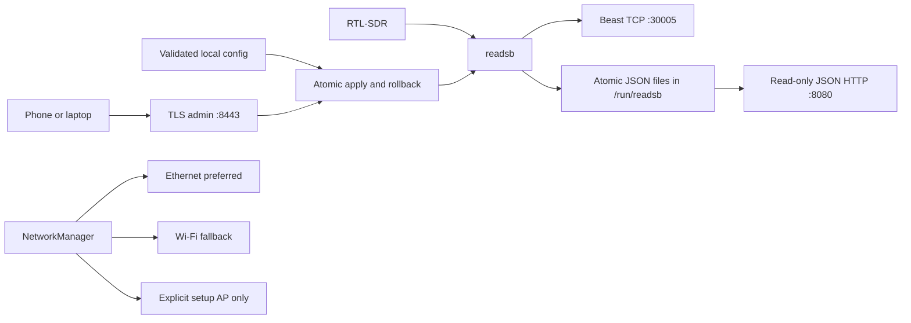

# Local-first ADS-B receiver appliance

This repository builds reproducible Armbian appliance images for Orange Pi Zero3 and Orange Pi Zero2. Each image runs an RTL-SDR and pinned [readsb](https://github.com/wiedehopf/readsb) locally. Normal installation is flash, boot, configure in a browser, and receive. It does not require an ADS-B platform, cloud service, database, container runtime, or SSH for routine setup.

The default LAN data interfaces are:

| Interface | Default | Exposure | Purpose |
| --- | --- | --- | --- |
| Beast TCP | `0.0.0.0:30005` | Private IPv4, ULA, and link-local sources only | Binary Beast stream for multiple simultaneous consumers |
| readsb JSON HTTP | `0.0.0.0:8080` | Private IPv4, ULA, and link-local sources only | Read-only `/data/aircraft.json`, `/data/receiver.json`, and `/data/stats.json` |
| Administration | `127.0.0.1:8443` | Localhost by default; configurable to one private management address | Authenticated HTTPS setup, status, and configuration |

Wildcard Beast and JSON listeners are protected by the appliance nftables table. They are not public services. Do not add router port forwards, public firewall exceptions, or a public admin bind. The schema rejects public literal addresses and an unspecified admin bind.

## Architecture



Active configuration is `/etc/adsb-receiver/config.json`. Generated readsb arguments, the last-known-good configuration, rollback material, bootstrap state, and the last apply error live under `/var/lib/adsb-receiver/`. Wi-Fi secrets live only in root-readable NetworkManager keyfiles. Administrator passwords are stored as salted scrypt hashes. They are not part of the JSON configuration.

The image has two explicit partitions: an ext4 root filesystem and a 128 MiB FAT32 data partition labeled `ADSB-BOOT`. The latter mounts at `/boot/adsb-bootstrap` with `nosuid,nodev,noexec,umask=0077`. It is limited to temporary setup credentials, recovery and factory-reset markers, and future narrowly scoped bootstrap metadata. Configuration, password hashes, Wi-Fi profiles, and TLS private keys remain on the root filesystem.

Before generating `setup-credentials.txt` or accepting a local recovery request, the appliance requires `findmnt` to identify `/boot/adsb-bootstrap` as the mounted `vfat` volume labeled `ADSB-BOOT`. A missing or incorrect mount fails configuration-mode bootstrap loudly instead of writing credentials into the root filesystem fallback directory.

`readsb.service` depends only on the installed local configuration. A factory configuration is rendered into the image, so first boot starts decoding even without Ethernet, Wi-Fi, DNS, internet access, or receiver coordinates. Coordinates are required before setup can be completed.

## Hardware targets

`config/targets.json` is the target source of truth. Every enabled target gets an isolated build and artifact.

| Target | Armbian board | Status | Estimated minimum | Practical recommendation |
| --- | --- | --- | --- | --- |
| Orange Pi Zero3 | `orangepizero3` | Enabled, physical acceptance pending | 1 GiB RAM, 8 GiB SD, Ethernet, one USB host port | 2 GiB RAM, 16 GiB high-endurance SD, stable PSU, RTL-SDR Blog V3 or equivalent |
| Orange Pi Zero2 | `orangepizero2` | Enabled, physical acceptance pending | 1 GiB RAM, 8 GiB SD, Ethernet, one USB host port | 2 GiB RAM, 16 GiB high-endurance SD, stable PSU, RTL-SDR Blog V3 or equivalent |

The build pins the Armbian framework, board kernel revision, Debian Trixie, and readsb commit. `./build.sh` builds every enabled target or only the named targets. Output remains separated under `dist/<target>/`.

## Build and validation

Run cheap checks before an image build:

```fish
python3 scripts/validate_repository.py
python3 -m unittest discover -s tests -v
bash -n build.sh userpatches/customize-image.sh userpatches/extensions/adsb-kernel-pin.sh userpatches/extensions/adsb-bootstrap-partition.sh scripts/inspect-built-image.sh
shellcheck build.sh userpatches/customize-image.sh userpatches/extensions/*.sh scripts/inspect-built-image.sh
actionlint .github/workflows/*.yml
git diff --check
```

Expected result:

```text
validated 2 target(s), 2 enabled
...
OK
```

The full Armbian build requires a privileged Docker-capable Linux host with at least 8 GiB RAM and 50 GiB free. From Fish on macOS, invoke the Bash script directly on that Linux host. Do not source it.

```fish
./build.sh
./build.sh orangepi-zero3
```

GitHub Actions is authoritative. `.github/workflows/validate.yml` runs the cheap gate. `.github/workflows/build-image.yml` is manual and uses the official Armbian Action pinned to `0620eb67885d19aeabd62655e60870ffd1efad63`. Appliance version `2026.08.22.4` is distinct from Armbian's internal version. The workflow records the exact repository commit in external build metadata, then inspects each completed image with `scripts/inspect-built-image.sh`. Matrix builds upload to one prerelease; a dependent job promotes it only after both targets pass inspection and metadata assembly. Build artifacts include the compressed image, checksum, partition and filesystem evidence, target snapshot, framework and OS revisions, kernel revision, readsb revision, and available Armbian source metadata.

The partition inspector asserts a root partition, vfat partition 2 labeled `ADSB-BOOT`, the root fstab mount contract, installed release metadata, and absence of persistent configuration, hashes, or PEM files on the FAT volume. Only a successful full Linux image build can prove that resulting disk layout. Repository checks prove the extension and inspection wiring, not the emitted image.

## Flash and first boot

1. Download the image and checksum for the correct board from a GitHub Release.
2. Verify the checksum on macOS.
3. Flash with Raspberry Pi Imager or Balena Etcher. Confirm the target disk twice because flashing overwrites it.
4. Insert the card, connect the RTL-SDR, optionally connect Ethernet, and boot.
5. On first boot, the appliance writes `setup-credentials.txt` at the root of the `ADSB-BOOT` FAT32 partition. This file contains the per-device setup SSID, unique AP password, setup URL, one-time setup password, and TLS certificate fingerprint.
6. Power the receiver down, read that file from the card on another computer, then boot again. This awkward little card shuffle avoids the much worse design of a universal setup password.

Checksum example:

```fish
shasum -a 256 -c adsb-receiver-orangepi-zero3-2026.08.22.4.img.xz.sha256
```

Expected result:

```text
adsb-receiver-orangepi-zero3-2026.08.22.4.img.xz: OK
```

If wired Ethernet has a usable DHCP address, Ethernet stays active and the setup file names its HTTPS URL. If Ethernet has no usable address, NetworkManager starts `ADSB-SETUP-<device suffix>` on `192.168.77.0/24`; the fixed gateway and setup URL are `https://192.168.77.1:8443/`. No separate `hostapd`, `dnsmasq`, or unmanaged `wpa_supplicant` configuration is installed.

Verify the displayed certificate fingerprint against `setup-credentials.txt` before accepting the per-device self-signed certificate. Authenticate as `setup` with the one-time setup password.

The onboarding page collects:

- Wi-Fi SSID and password, if Wi-Fi is wanted
- receiver name, latitude, longitude, and altitude in meters
- RTL-SDR gain, with `auto` recommended initially
- Beast and JSON listener enablement, addresses, and ports
- administrator password and run-mode management address
- DHCP or static IPv4 settings for Ethernet and Wi-Fi

The server validates Wi-Fi input, writes a candidate root-only NetworkManager profile, activates and verifies it, then installs and verifies the final profile. Candidate objects and files are always removed. Failure restores the prior appliance-managed profile and connection state where NetworkManager permits. Secrets never appear in a command argument or request log. On successful setup it completes the configuration transaction, invalidates the one-time credential by removing bootstrap state, removes `setup-credentials.txt` when the FAT volume is writable, disables the AP, and reboots into run mode. A stale setup file can remain after abrupt power loss, but its setup credential becomes invalid after successful completion.

## Run-mode networking

NetworkManager owns both generated profiles. Ethernet and configured Wi-Fi support DHCP, the default, or static IPv4 with `address`, `prefixLength`, optional `gateway`, and up to four `dns` addresses. Wi-Fi secrets remain only in its root-readable keyfile. Ethernet uses route metric `100`; Wi-Fi uses `600`, so Ethernet is preferred and Wi-Fi remains fallback. Loss of an uplink does not stop local decoding.

Run mode never enters setup merely because Ethernet is down. Configuration mode uses wired Ethernet only when it has an RFC1918 address in `10/8`, `172.16/12`, or `192.168/16`. Loopback, link-local, documentation, and publicly routed addresses are ineligible, so the appliance uses its temporary AP instead. The setup HTTPS port is added explicitly to the private-source nftables policy and does not depend on run-mode admin settings.

## Consumer endpoints

For a receiver at `192.168.1.40`:

| Consumer | Connection to configure |
| --- | --- |
| `adsb-feeder` | Beast TCP host `192.168.1.40`, port `30005` |
| SkySpy | Beast host `192.168.1.40`, port `30005`, or JSON base `http://192.168.1.40:8080/data/` if that deployment supports readsb JSON |
| Aerodrome | Beast host `192.168.1.40`, port `30005`, or JSON base `http://192.168.1.40:8080/data/` if supported by the installed version |

Container implementations use different environment variable names. The generic Compose wiring is:

```yaml
services:
  local-adsb-consumer:
    image: <consumer-image-and-pinned-tag>
    environment:
      # Map these values to the consumer's documented settings.
      RECEIVER_PROTOCOL: beast
      RECEIVER_HOST: 192.168.1.40
      RECEIVER_PORT: "30005"
      READSB_JSON_BASE_URL: http://192.168.1.40:8080/data/
```

Do not copy those generic variable names blindly. Use the actual names supported by the pinned `adsb-feeder`, SkySpy, or Aerodrome image. The stable appliance-side contract is the host, protocol, port, and JSON paths.

Test the read-only HTTP service:

```fish
curl -fsS http://192.168.1.40:8080/data/receiver.json | jq
curl -fsS http://192.168.1.40:8080/data/aircraft.json | jq '.aircraft | length'
```

Expected result:

```text
{
  "version": "...",
  "refresh": 1000,
  "lat": 41.8781,
  "lon": -87.6298
}
0
```

Zero aircraft is valid when reception is quiet. HTTP `503` means readsb has not produced the requested file yet.

The pinned readsb contract uses `--net-bo-port 30005` for its Beast TCP server, `--net-bind-address` for the Beast bind, and `--write-json /run/readsb --write-json-every 1` for atomic JSON files. The small HTTP service exposes only `aircraft.json`, `receiver.json`, and `stats.json`; it has no write or admin routes. readsb accepts multiple concurrent Beast clients.

The pinned readsb revision accepts receiver latitude and longitude but does not define a `--alt` option. Altitude remains validated appliance metadata for onboarding and consumers; it is intentionally not emitted as a readsb argument.

## Local configuration contract

The machine-readable schema is `schemas/receiver-config.schema.json`; a complete example is `examples/local-config.json`. Schema version 3 rejects unknown fields and arbitrary readsb arguments. Version 3 is an intentional breaking migration from version 2: add an `ipv4` object to each network interface, add the factory-reset marker contract, change marker paths to `/boot/adsb-bootstrap`, and remove `outboundConnectors`. Existing version 2 files must be migrated through configuration mode rather than applied unchanged.

Important rules:

- `setupComplete: true` requires latitude, longitude, and altitude.
- Beast, JSON HTTP, and admin ports must be distinct when enabled.
- Beast and JSON addresses can be `0.0.0.0`, loopback, link-local, or a private IPv4 address.
- Admin cannot bind `0.0.0.0` or a public literal address. It defaults to localhost.
- Wi-Fi and administrator secrets are not schema fields.
- The appliance never forwards to tracking sites. Use `adsb-feeder` or another external Beast/JSON consumer for that responsibility.
- The setup subnet, gateway, recovery marker, and factory-reset marker are fixed safety contracts.

An apply is a bounded transaction over the active config, generated readsb arguments, generated nftables rules, affected services, and an optional staged administrator credential. Files are written atomically, firewall/readsb/JSON services restart, then health must remain good for 5 seconds within an 8-second deadline. Promotion requires active services, the configured Beast socket, valid local `aircraft.json` HTTP output and generated receiver metadata when JSON is enabled, plus a loaded `inet adsb_receiver` nftables table.

Before any candidate with run-mode administration enabled can enter that transaction, its address must be loopback or currently assigned to a local interface. If its address or port differs from the running admin endpoint, the appliance must also bind a temporary socket to the candidate endpoint successfully. A failed ownership or bind check rejects the candidate before config or LKG changes.

On candidate failure, the previous config, args, firewall file, and credential are restored; firewall/readsb/JSON are restarted and the restored configuration receives the same health check. `last-known-good.json` is unchanged. A rollback failure is recorded distinctly in `last-apply-error.json` and creates a persistent recovery latch. Backup retention is one previous generation per managed file.

Validate and apply locally on the appliance:

```bash
sudo adsb-config validate /path/to/candidate.json
sudo adsb-config apply /path/to/candidate.json
sudo adsb-config status
```

Expected result:

```text
{
  "mode": "run",
  "services": {
    "readsb.service": "active",
    "adsb-json-http.service": "active",
    "adsb-admin.service": "active"
  },
  ...
}
```

These are device-side Bash commands. Controller-side macOS examples in this document use Fish-compatible syntax.

## Web administration security and access

Configuration mode binds only to the selected configuration interface: the usable wired address or `192.168.77.1` on the setup AP. Run mode binds to `admin.address`. The default `127.0.0.1` deliberately provides no unauthenticated LAN administration. To administer from a LAN browser, set one specific private management address during onboarding.

All admin modes use a per-device self-signed TLS certificate with TLS 1.2 or newer. Run-mode writes require HTTP Basic authentication with the salted scrypt password hash, a same-origin check, an unpredictable CSRF header token, and a matching `Secure`, `HttpOnly`, `SameSite=Strict` cookie. Request bodies and secrets are not logged.

To disable the run-mode UI, set `admin.enabled` to `false` and apply. To re-enable it, use recovery mode and set it to `true`. To change the password, enter a new one on the admin page. Leaving the password field empty preserves the current hash.

To verify the installed certificate fingerprint on the appliance:

```bash
openssl x509 -in /etc/adsb-receiver/admin-cert.pem -noout -fingerprint -sha256
```

Expected result:

```text
sha256 Fingerprint=AA:BB:...:FF
```

Compare every byte with the fingerprint obtained from the boot-partition setup file or a previously trusted record.

## Non-SSH recovery

To request configuration mode on the next boot:

1. Power down the appliance and mount the FAT32 volume labeled `ADSB-BOOT` on another computer.
2. Create `recovery-request` at the volume root containing exactly `ADSB-RECEIVER-CONFIG-MODE` plus one newline.
3. Reinsert the card and boot.
4. Read the newly generated `setup-credentials.txt`, then use the wired setup URL or temporary AP.

Fish-friendly macOS example after confirming the exact mounted boot volume:

```fish
printf 'ADSB-RECEIVER-CONFIG-MODE\n' > /Volumes/ADSB-BOOT/recovery-request
diskutil unmount /Volumes/ADSB-BOOT
```

Expected result:

```text
Volume ADSB-BOOT on disk... unmounted
```

The appliance accepts only a regular file with exact bounded content at the fixed path. A misspelled, oversized, symlinked, or differently formatted marker is ignored. On boot it writes `/var/lib/adsb-receiver/recovery-latch` durably before removing the FAT marker. That latch survives reboot, setup failure, and power loss. It is cleared only after successful configuration completion, when the temporary AP, setup file, and one-time credential state are also removed. Merely starting the admin UI or authenticating does not clear it.

If a bad configuration prevents readsb from staying active, apply automatically restores the previous files and records the error. An administrator can also invoke:

```bash
sudo adsb-config rollback
```

Expected result: `readsb.service` returns to `active` using `/var/lib/adsb-receiver/last-known-good.json`. Reflashing is the final recovery path, not the first one.

## Factory reset

Factory reset is destructive to appliance-managed configuration. It removes active/LKG/previous configs, generated args and firewall state, admin hash, generated TLS certificate and private key, appliance-managed NetworkManager profiles, bootstrap state, errors, and other files under `/var/lib/adsb-receiver`. It preserves the OS, appliance binaries, `/etc/adsb-receiver-release`, injected source provenance, and the administrator's SSH authorized keys.

After confirming the exact mounted volume, create the separate exact marker and safely unmount it:

```fish
printf 'ADSB-RECEIVER-FACTORY-RESET\n' > /Volumes/ADSB-BOOT/factory-reset
diskutil unmount /Volumes/ADSB-BOOT
```

At boot, factory reset takes precedence over recovery. The request is durably latched before the FAT marker is removed. Initialization starts after the local NetworkManager daemon, removes loaded `adsb-wifi`, `adsb-ethernet`, candidate, and setup-AP connection objects, reloads NetworkManager, then removes their persistent keyfiles. Reset is idempotent across a restart: the latch remains until runtime cleanup, file deletion, and factory-config regeneration complete. The next network-mode start creates new per-device setup credentials and enters first boot.

## Version status and diagnostics

`adsb-config status` reports image version, target ID, source commit or explicit `unavailable`, pinned Armbian and readsb revisions, Debian release, running kernel, installed readsb version, uptime, services, endpoints, mode, recovery/reset state, SDR detection, and the last redacted apply error.

Generate a root-readable diagnostic archive from the CLI:

```bash
sudo adsb-config diagnostics /var/tmp/adsb-receiver-diagnostics.tar.gz
sudo tar -tzf /var/tmp/adsb-receiver-diagnostics.tar.gz
```

The archive contains release/status metadata, redacted config, up to 400 recent appliance journal records, NetworkManager device state and redacted managed-profile metadata, addresses, routes, listening sockets, USB, disk use, nftables state, and recovery/apply state. It excludes profile PSKs, credential/hash documents, bootstrap state and passwords, TLS keys, authorization headers, and unrelated host files. The archive mode is `0600`; inspect it before sharing.

The root-running admin and network-mode services need NetworkManager changes, protected file writes, service restarts, and reboot orchestration. Their units retain `ProtectSystem=strict`, `ProtectHome=yes`, narrow writable paths/address families, restrictive umasks, and `RestrictSUIDSGID=yes`. Initialize is a root oneshot with an empty capability set. readsb and the JSON server remain capability-free with `NoNewPrivileges=yes`; the firewall oneshot requires the host's nftables authority but no writable path beyond generated state.

## Troubleshooting

Service and SDR checks:

```bash
systemctl status readsb.service adsb-json-http.service adsb-admin.service adsb-network-mode.service
adsb-config status
lsusb -d 0bda:2838
ss -lntp | grep -E ':(30005|8080|8443)\b'
```

Expected healthy indicators:

```text
Active: active (running)
Bus ... ID 0bda:2838 Realtek Semiconductor Corp. RTL2838 DVB-T
LISTEN ... :30005 ... readsb
LISTEN ... :8080 ... adsb-json-server
```

The admin listener appears only when enabled and bound to an address present on the device. A different RTL-SDR USB ID can be healthy even if the exact `lsusb -d` check is empty.

Recent errors, with no secret-bearing request bodies:

```bash
journalctl -u adsb-initialize -u adsb-network-mode -u readsb -u adsb-json-http -u adsb-admin --since today
sudo cat /var/lib/adsb-receiver/last-apply-error.json
nmcli device status
nmcli connection show --active
```

Expected healthy network state resembles:

```text
DEVICE  TYPE      STATE      CONNECTION
end0    ethernet  connected  Wired connection 1
wlan0   wifi      connected  adsb-wifi
```

Do not include NetworkManager keyfiles, `setup-credentials.txt`, HTTP Authorization headers, or `/var/lib/adsb-receiver/bootstrap-state.json` in diagnostics.

## Retired central configuration workflow

The mandatory signed config-server design, Minisign key, refresh timer, agent, Caddy example, and schema version 1 are removed. There is no normal startup fetch and no required `adsb-platform` deployment. A future remote management feature must be separately authenticated, explicitly enabled, disabled by default, and feed the same local validate-and-apply path. It must never become a readsb startup dependency.

## What validation does and does not prove

Repository tests cover schema validation, connector rejection, deterministic readsb arguments, exact marker/latch selection, complete file rollback and rollback-failure recovery, bounded health decisions, transactional credentials, NetworkManager DHCP/static profile generation, Wi-Fi failure cleanup, RFC1918 setup selection, setup firewall policy, factory-reset file scope, diagnostics redaction, systemd structure, partition-extension contracts, immutable build pins, workflow action pins, and post-build inspection wiring.

That evidence does not prove an image boots or that the board-specific Ethernet name, FAT volume, Wi-Fi AP, NetworkManager activation, USB power, RTL-SDR, Beast stream, JSON consumers, TLS browser flow, recovery over real power loss, factory reset, or static routing work on hardware. Complete this checklist separately for both Orange Pi targets and do not mark an item from repository tests alone:

- [ ] Mount `ADSB-BOOT` on macOS; read `setup-credentials.txt`; write exact recovery and factory-reset markers; safely unmount.
- [ ] Enter recovery, confirm the FAT marker is consumed, interrupt power before completion, reboot back into recovery via the persistent latch, then complete setup and confirm latch removal.
- [ ] Apply an intentionally nonfunctional listener candidate; confirm config, readsb args, nftables rules, every affected service, and LKG match the restored state.
- [ ] Observe that LKG promotion happens only after the bounded 5-second stable interval.
- [ ] Fail candidate Wi-Fi authentication and final activation; confirm no candidate object/file remains and the prior connection is restored.
- [ ] In a controlled test network, give Ethernet only a globally routed address and confirm setup binds to the AP, not that address.
- [ ] Perform FAT-marker factory reset; verify every documented mutable item is gone, preserved items remain, and first-boot setup returns.
- [ ] Validate Ethernet static IPv4, Wi-Fi static IPv4, Ethernet metric preference, and Wi-Fi fallback.
- [ ] Validate current real versions of `adsb-feeder`, SkySpy, and Aerodrome against the appliance endpoints.
- [ ] Sustain at least three concurrent Beast clients and three concurrent JSON HTTP consumers.
- [ ] Interrupt power in steady state, during or immediately after safe config apply, in recovery mode, and after Wi-Fi provisioning; verify the documented durable state each time.
- [ ] Confirm RTL-SDR enumeration, readsb decoding, Beast frames, valid JSON including a zero-aircraft case, browser TLS/fingerprint flow, and both board-specific interface names.
